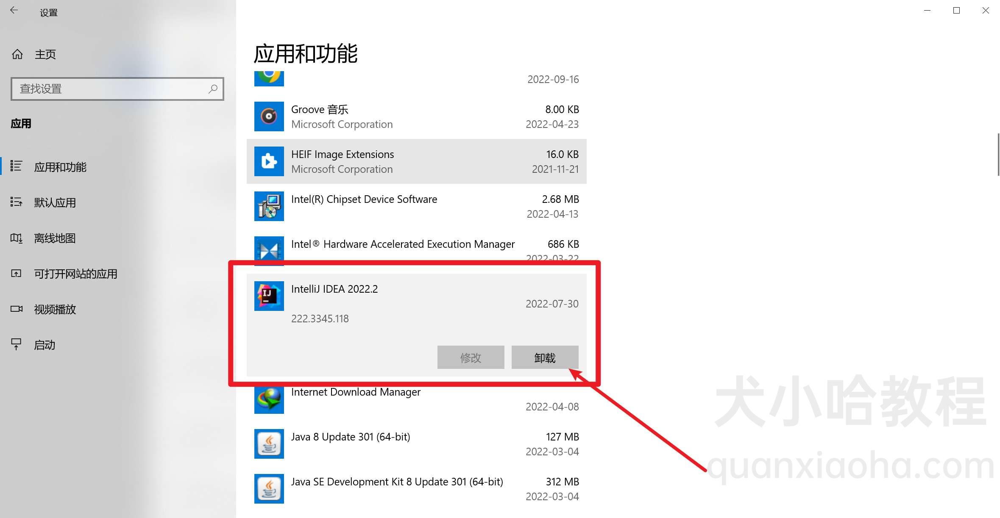
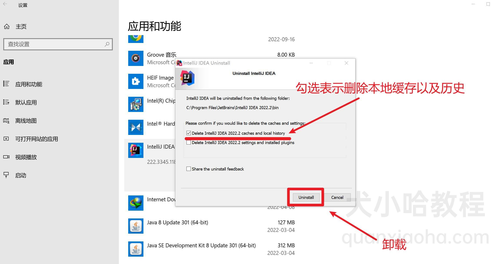
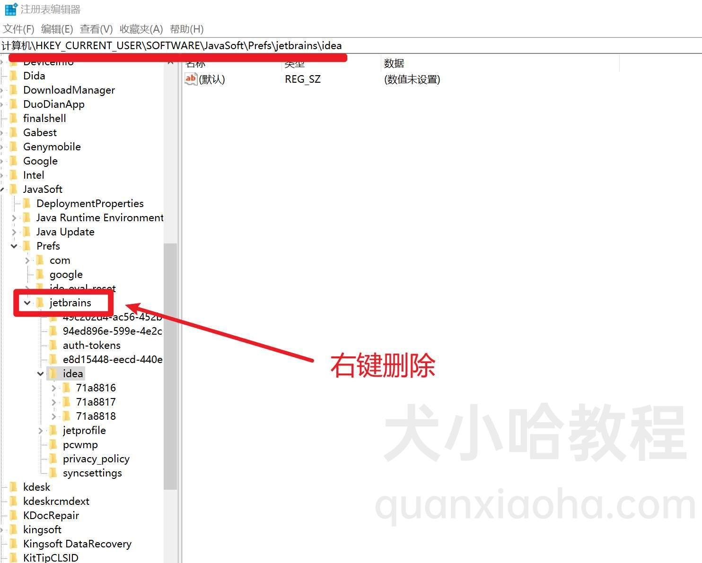
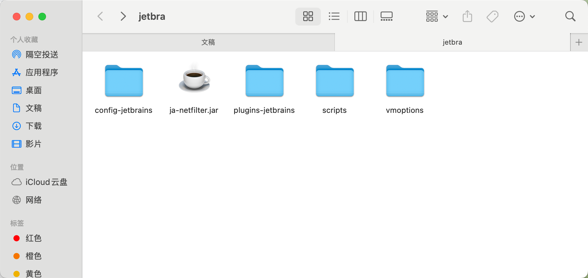
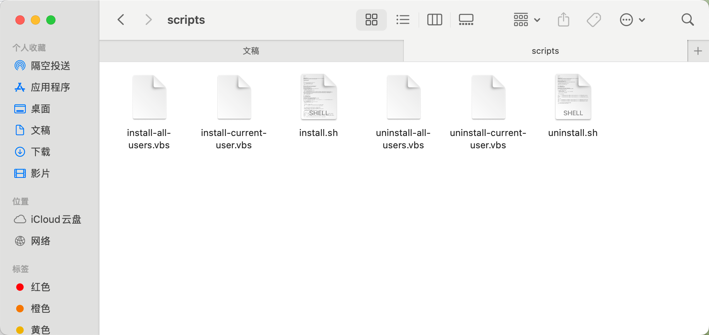

# IDEA 破解工具图文激活教程

## 卸载干净

### Windows

> Windows 系统要想彻底卸载 IDEA, 步骤如下：

1. 点击屏幕左下角 Windows 图标 -> 设置 -> 应用

2. 在应用中找到 IDEA, 单击它会出现卸载按钮，点击开始卸载：



3. 勾选第一栏 Delete IntelliJ IDEA 2022.2 caches and local history，表示同时删除 IDEA 本地缓存以及历史：



> Delete IntellJ IDEA 2022.2 settings and installed plugins : 删除 IDEA 相关设置，如字体大小、主题等等，以及删除已安装的插件。
> 此选项可不用勾选。

4. 注册表清理

较老版本的 IDEA 安装成功后，会在注册表中都会留下一些信息，也需要清理一下。

按住快捷键 windos + R, 然后输入 regedit 回车调出注册表。

依次点击菜单 计算机\HKEY_CURRENT_USER\SOFTWARE\JavaSoft\Prefs\jetbrains， 然后右键删除。注意，如果注册表中未发现下图中的信息，说明你安装的 IDEA 版本较新，可以不用清理注册表，继续执行后续的步骤：




5. 残留清理
最后，还有几个地方的缓存数据需要删除：

```shell

C:\用户\${用户名称}\IdeaProjects\
# 如果你想删除 IDEA 相关，则只需要删除 JetBrains 目录下包含 IDEA 的文件夹即可
C:\用户\${用户名称}\AppData\Roaming\JetBrains
# 如果你想删除 IDEA 相关，则只需要删除 JetBrains 目录下包含 IDEA 的文件夹即可
C:\用户\${用户名称}\AppData\Local\JetBrains
C:\用户\公用\.jetbrains
# 如果你想删除 IDEA 相关，则只需要删除 JetBrains 目录下包含 IDEA 的文件夹即可
C:\Program Files\JetBrains
C:\ProgramData\Microsoft\Windows\Start Menu\Programs\JetBrains\


```


### Mac
 
1. 卸载 IDEA 程序  打开【访达】-> 【应用程序】, 找到 IDEA 右键【移到废纸篓】

2. 残留清理

打开终端，执行如下命令，进入 Library 目录下，准备删除 IDEA 的残留信息：

```shell

cd /Users/XXX/Library

```

> 注意：路径中的 XXX 为用户名，替换成你实际的用户名，再执行即可。

新老版本残留所在的目录不一样
建议先 cd 进去看下文件夹命名规则，再删除。

较新版本

```shell

rm -rf Preferences/JetBrains/IntelliJIdea*
rm -rf Caches/JetBrains/IntelliJIdea*
rm -rf Application\ Support/JetBrains/IntelliJIdea*
rm -rf Logs/JetBrains/IntelliJIdea*

```

> TIP: * 表示版本号。

老版本

```shell

rm -rf Preferences/IntelliJIdea*
rm -rf Caches/IntelliJIdea*
rm -rf Application\ Support/IntelliJIdea*
rm -rf Logs/IntelliJIdea*

```


### 开始破解

1. 第一步：解压工具包

首先，解压zip破解工具包，并打开文件的后缀名，否则提示无法找到文件，解压后如下：




2. 第二步：执行脚本，添加变量信息
添加激活工具路径信息，通过执行激活工具scripts文件下的脚本，自动添加，一键激活。

在激活工具下，其中scripts中是脚本文件，我们进入到该文件下，可以看到多个脚本文件，主要激活工具使用。




3. Mac/Linux用户：
切换到scipts文件下（不会的自行百度），执行如下命令（因修改环境变量，需要输入电脑开机密码确认）：

```shell

sudo bash install.sh

```

出现如上图信息，表示执行完成。如果提示：“Operation not permitted while System Integrity Protection is engaged”，请先赋权，在重新执行。

```shell
# 操作权限
chmod 755 install.sh

```
赋权之后，重新执行安装脚本口令

```shell
sudo bash install.sh
# 如果还是提示无法执行，可直接执行脚本
./install.sh 或 sodu bash ./install.sh

#如果都不行，就需要关闭Mac的SIP系统保护机制，终端下执行csrutil disable，回车，然后重启电脑，关闭后在执行上面的安装脚本。
```

4. 重启IDE或电脑

保证第二步执行成功之后，可以继续第三步。Mac和Linux用户需要重启下电脑。必须重启电脑才能保证工具生效。

> 重要说明：执行完脚本工具，不要随便移动激活工具位置，否则会造成IDE无法启动。如果不想用了，先执行破解的卸载脚本 sudo bash uninstall.sh 然后在删除工具并重启电脑即可。

5. 输入激活码
打开IDE，选择Activation Code，添加专属永久激活码，根据自己的IDE选择对应激活码，这里复制IntelliJ IDEA激活码：

> 专属激活码下载：http://jets.idejihuo.com


### 常见问题

#### 1. “jar-netfilter.jar not found”错误

解决：
- 下载完激活工具，是zip压缩文件，请务必先解压工具，不要直接打开zip文件操作，如果没有解压工具，请先下载解压工具
- 关闭电脑隐藏文件后缀名功能（具体请百度）
- 移动激活工具时，所有文件一起移动
- 有些电脑安装有安全软件会阻止执行外部脚本文件，可以尝试暂时关闭
- 执行脚本所在的文件路径尽量不要存在中文


```shell
https://xuanyuan.me/blog/archives/981

https://3.jetbra.in/

https://gitee.com/superbeyone/J2_B5_A5_C4/tree/master/licenses/2025

```

### 激活码

```

FV8EM46DQYC5AW9-eyJsaWNlbnNlSWQiOiJGVjhFTTQ2RFFZQzVBVzkiLCJsaWNlbnNlZU5hbWUiOiJtZW5vcmFoIHBhcmFwZXQiLCJsaWNlbnNlZVR5cGUiOiJQRVJTT05BTCIsImFzc2lnbmVlTmFtZSI6IiIsImFzc2lnbmVlRW1haWwiOiIiLCJsaWNlbnNlUmVzdHJpY3Rpb24iOiIiLCJjaGVja0NvbmN1cnJlbnRVc2UiOmZhbHNlLCJwcm9kdWN0cyI6W3siY29kZSI6IlBDV01QIiwiZmFsbGJhY2tEYXRlIjoiMjAyNi0wOS0xNCIsInBhaWRVcFRvIjoiMjAyNi0wOS0xNCIsImV4dGVuZGVkIjp0cnVlfSx7ImNvZGUiOiJQUlIiLCJmYWxsYmFja0RhdGUiOiIyMDI2LTA5LTE0IiwicGFpZFVwVG8iOiIyMDI2LTA5LTE0IiwiZXh0ZW5kZWQiOnRydWV9LHsiY29kZSI6IlBEQiIsImZhbGxiYWNrRGF0ZSI6IjIwMjYtMDktMTQiLCJwYWlkVXBUbyI6IjIwMjYtMDktMTQiLCJleHRlbmRlZCI6dHJ1ZX0seyJjb2RlIjoiUFNJIiwiZmFsbGJhY2tEYXRlIjoiMjAyNi0wOS0xNCIsInBhaWRVcFRvIjoiMjAyNi0wOS0xNCIsImV4dGVuZGVkIjp0cnVlfSx7ImNvZGUiOiJJSSIsImZhbGxiYWNrRGF0ZSI6IjIwMjYtMDktMTQiLCJwYWlkVXBUbyI6IjIwMjYtMDktMTQiLCJleHRlbmRlZCI6ZmFsc2V9XSwibWV0YWRhdGEiOiIwMjIwMjQwNzAyUFNBWDAwMDAwNVgiLCJoYXNoIjoiMTIzNDU2NzgvMC01NDE4MTY2MjkiLCJncmFjZVBlcmlvZERheXMiOjcsImF1dG9Qcm9sb25nYXRlZCI6ZmFsc2UsImlzQXV0b1Byb2xvbmdhdGVkIjpmYWxzZSwidHJpYWwiOmZhbHNlLCJhaUFsbG93ZWQiOnRydWV9-cH8qBniG31nF8954hthJJuzF6Fk4RQ9T03IfNxsFkuxUcwaAGHKOcRudvBZIAbLwDDFw63q2QZsnpwthBb/6IqBYnJrjRC83a8wkYKGN8HqAyDtbqdLOxLjcaiAiSKzektfAXn6nGNfDeygcFr/WzMfI0on/43ByuwxmSrjwYc4M8SCR0nkDAi0XwXNnFp3vSp0gJQd+lJtkSHO2KR7gUyNDZOPVduljJGbdLJUK6UcUjrlAd6NrTNqpu5P7hcYRaNzjoJ0KeIx5k9KmMCdcfQBia/zSHUbwZiecFsyjxqtIU0C3TDaX1OM4siJVDpgrXi+ocY86hiiYE79ygJf2IA==-MIIETDCCAjSgAwIBAgIBDTANBgkqhkiG9w0BAQsFADAYMRYwFAYDVQQDDA1KZXRQcm9maWxlIENBMB4XDTIwMTAxOTA5MDU1M1oXDTIyMTAyMTA5MDU1M1owHzEdMBsGA1UEAwwUcHJvZDJ5LWZyb20tMjAyMDEwMTkwggEiMA0GCSqGSIb3DQEBAQUAA4IBDwAwggEKAoIBAQCUlaUFc1wf+CfY9wzFWEL2euKQ5nswqb57V8QZG7d7RoR6rwYUIXseTOAFq210oMEe++LCjzKDuqwDfsyhgDNTgZBPAaC4vUU2oy+XR+Fq8nBixWIsH668HeOnRK6RRhsr0rJzRB95aZ3EAPzBuQ2qPaNGm17pAX0Rd6MPRgjp75IWwI9eA6aMEdPQEVN7uyOtM5zSsjoj79Lbu1fjShOnQZuJcsV8tqnayeFkNzv2LTOlofU/Tbx502Ro073gGjoeRzNvrynAP03pL486P3KCAyiNPhDs2z8/COMrxRlZW5mfzo0xsK0dQGNH3UoG/9RVwHG4eS8LFpMTR9oetHZBAgMBAAGjgZkwgZYwCQYDVR0TBAIwADAdBgNVHQ4EFgQUJNoRIpb1hUHAk0foMSNM9MCEAv8wSAYDVR0jBEEwP4AUo562SGdCEjZBvW3gubSgUouX8bOhHKQaMBgxFjAUBgNVBAMMDUpldFByb2ZpbGUgQ0GCCQDSbLGDsoN54TATBgNVHSUEDDAKBggrBgEFBQcDATALBgNVHQ8EBAMCBaAwDQYJKoZIhvcNAQELBQADggIBABKaDfYJk51mtYwUFK8xqhiZaYPd30TlmCmSAaGJ0eBpvkVeqA2jGYhAQRqFiAlFC63JKvWvRZO1iRuWCEfUMkdqQ9VQPXziE/BlsOIgrL6RlJfuFcEZ8TK3syIfIGQZNCxYhLLUuet2HE6LJYPQ5c0jH4kDooRpcVZ4rBxNwddpctUO2te9UU5/FjhioZQsPvd92qOTsV+8Cyl2fvNhNKD1Uu9ff5AkVIQn4JU23ozdB/R5oUlebwaTE6WZNBs+TA/qPj+5/we9NH71WRB0hqUoLI2AKKyiPw++FtN4Su1vsdDlrAzDj9ILjpjJKA1ImuVcG329/WTYIKysZ1CWK3zATg9BeCUPAV1pQy8ToXOq+RSYen6winZ2OO93eyHv2Iw5kbn1dqfBw1BuTE29V2FJKicJSu8iEOpfoafwJISXmz1wnnWL3V/0NxTulfWsXugOoLfv0ZIBP1xH9kmf22jjQ2JiHhQZP7ZDsreRrOeIQ/c4yR8IQvMLfC0WKQqrHu5ZzXTH4NO3CwGWSlTY74kE91zXB5mwWAx1jig+UXYc2w4RkVhy0//lOmVya/PEepuuTTI4+UJwC7qbVlh5zfhj8oTNUXgN0AOc+Q0/WFPl1aw5VV/VrO8FCoB15lFVlpKaQ1Yh+DVU8ke+rt9Th0BCHXe0uZOEmH0nOnH/0onD

```