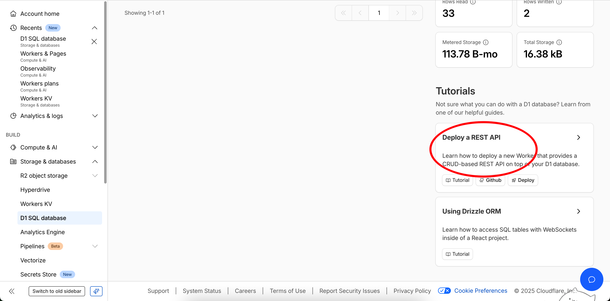
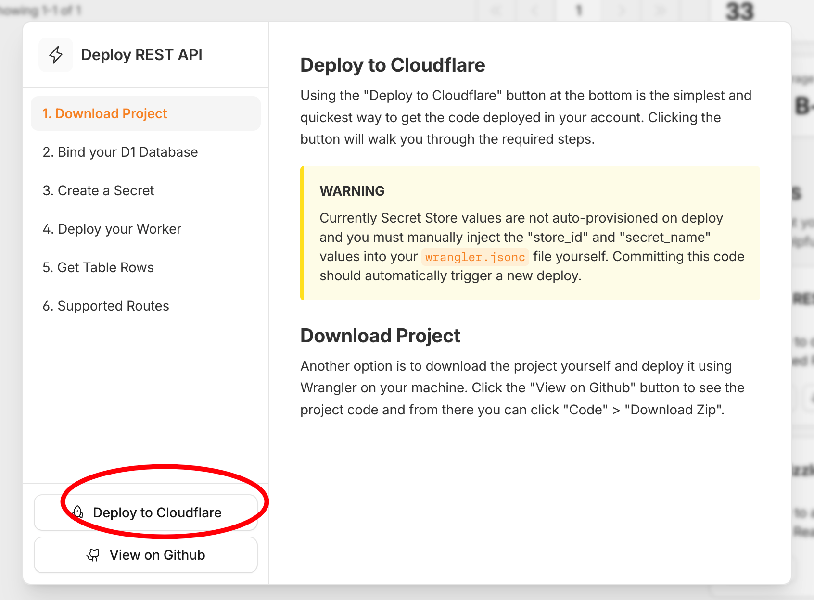
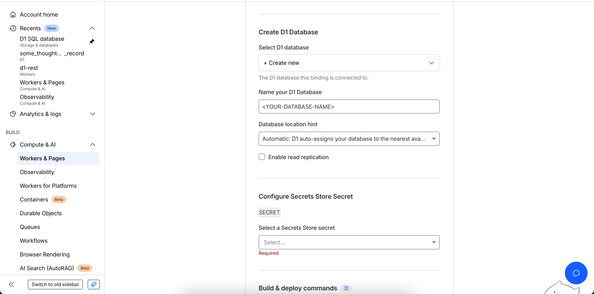

# cloudflare 部署 REST API


```shell

des: Deploy a REST API

how to deploy a new Worker that provides a CRUD-based REST API on top of your D1 database.
```

## depoly


## create an application

1. 设置 git 仓库

2. 项目命名

3. 选择 D1 Database

4. 配置 Secret

5. deploy




